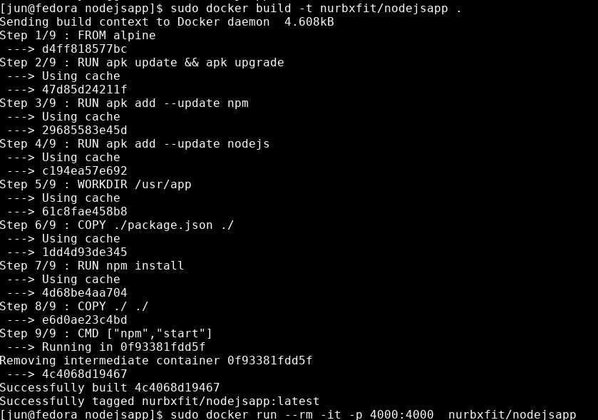

## Building nodejs webapp using dockerfile
- in this example, we create a dockerfile to create a nodejs server.
- we will work with volume and port mapping.

## Setting up our project.
- first create a new project folder, I named it `nodejsapp`.
- then inside the folder, create a `package.json`, `index.js` and `Dockerfile` files.
- this is just a simple nodejs app.
- our `package.json` file look like this.
```json
//package.json
{
    "dependencies": {
        "express": "*"
    },
    "scripts": {
        "start": "node index.js"
    }
}
```

```js
//index.js
const express = require('express');

const app = express();

app.get('/',(req,res,next)=>{
    res.send("Hello Docker");
})

const PORT = 4000 || process.env.PORT;
app.listen(PORT,()=>{
    console.log(`Server Started on port ${PORT}`)
})
```

## using alpine as our base image.
- our `Dockerfile` will look something like this.
```Dockerfile
FROM alpine

#install dependencies.
RUN apk update && apk upgrade
RUN apk add --update npm
RUN apk add --update nodejs

# install node dependencies.
RUN npm install

# on container start
CMD ["npm","start"]

```
- here look like a simple Dockerfile.
- but there is a problem with this file.
- if we try to build this, we will got a `npm install` error.
- because our `npm` cannot find the `package.json` file.
- to fix this, we must set up our volume, by copying our host project files into our container working directory.
- to do this we add these lines before we `RUN npm install`.
```Dockerfile
# setting up our volume.
# copy from our current directory into our container.
# we can change our workdir to anything.
WORKDIR /usr/app 
COPY ./ /usr/app
```
- if we didn't specify the workdir for our files.
- the COPY command by default will copy our project files into our root directory if we use 
```Dockerfile
COPY ./ ./
```
- if we specify a `workdir`.
- if we use `./` as our container path for our destination.
- it will copy into the workdir.
```Dockerfile
WORKDIR /usr/app
COPY ./ ./
```
- this is same as `COPY ./ /usr/app`.
- if we didn't specify our workdir but we copy into `/usr/app`.
```Dockerfile
COPY ./ /usr/app
```
- when we `RUN npm install`.
- our `RUN` command will run at the root directory and it still can't find the package.json files that was copied into `/usr/app`.

- our full Dockerfile will look like this.
```Dockerfile
#Dockerfile
FROM alpine

#setting up our volume.
# copy from our current directory into our container.
WORKDIR /usr/app
COPY ./ /usr/app

#install dependencies.
RUN apk update && apk upgrade
RUN apk add --update npm
RUN apk add --update nodejs

# install node dependencies.
RUN npm install

# on container start
CMD ["npm","start"]
```

- here, there will likely be no error when we build our image.
- building image using 
```bash
$sudo docker build -t nodejsapp .
```
- we can then run it using 
```bash
$sudo docker run --rm -it nodejsapp
```
- we will notice a text saying Server started on port 4000.
- but when we open it in our browser, we can't really access our webserver.
- the problem here is because our host port are not properly mapped to the container port.
- we must map our container port so request can be fowarded from our host to the container.
- we specify the port mapping when we run our container.
```bash
$sudo docker run --rm -it -p <hostport>:<containerport> nodejsapp
```
- example mapping our host port `4444` to our container port `4000` running nodejs server.
```bash
$sudo docker run --rm -it -p 4444:4000 nodejsapp
```
- then if we go to `localhost:4444` in our browser, we will see `Hello Docker`.


## Editing our source code.
- if we make changes to our source code or install any node dependencies.
- the webpage doesn't changes, because our container that we are running is based on the image snapshot that we build.
- to update our container, we need to rebuild our image and re-run our container.
- from our current Dockerfile configuration.
- all commands below the COPY command will need to run everytime we rebuild our images.
- even tho we already installed `npm` and `nodejs` and is should already be in the images cache.
```Dockerfile
# These command will run again.
# because docker deteact changes in COPY command.

#install dependencies.
RUN apk update && apk upgrade
RUN apk add --update npm
RUN apk add --update nodejs

# install node dependencies.
RUN npm install
```
- to overcome this, we can put our copy command after the RUN command.
- and everytime we rebuild our image. it will use the cache from previous build.
- and only update the source code in `COPY` command.
- our dockerfile will look something like this.
```Dockerfile
FROM alpine

# install software dependencies
RUN apk update && apk upgrade
RUN apk add --update npm
RUN apk add --update nodejs

# setup work dir
WORKDIR /usr/app

# if we made change to package.json, using cache ends here.
# copy package.json into work dir
COPY ./package.json ./

# install node dependencies.
RUN npm install

# if we made change to source file, using cache ends here.
# COPY the rest of files in our host project directory.
COPY ./ ./ 

# RUN OUR WEBSERVER
CMD ["npm","start"]
```
- after we build our image.
- next time when we make changes to our source code and rebuild our image.
- noticed that the text `Using cache`, will only missing in the part 
```Dockerfile
COPY ./ ./
```
