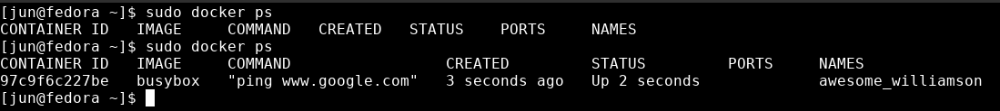

# Why use Docker ?
- enable easily setting up enviroments for development or deployment.
- easily install or run software in a machine without conflicting with other dependencies.

# What is Docker.
- Docker is a software or ecosystem for creating and running containers.

## Image
- a file with all installed dependencies and configs to run a program.
- it is like a bundle of self seperated libraries needed for a program.
- because we use the term Image, we can look this as the ISO image we use in VM.
- instead of storing file for the whole operating system, docker image only store needed dependencies and filesystem snapshot.

## Container
- an instance of image, that runs a prgram on our machine.
- it run the program as a process with dependencies sperated from our host.
- we can see this as the instance of VM image booted.

# Installation
## Fedora / CentOS.
- current (jun 2021) docker package name is called `docker-ce`
- previously named `docker` or `docker-engine`
- remove previous version of docker
```sh
 sudo dnf remove docker \
                  docker-client \
                  docker-client-latest \
                  docker-common \
                  docker-latest \
                  docker-latest-logrotate \
                  docker-logrotate \
                  docker-selinux \
                  docker-engine-selinux \
                  docker-engine
```
- there are few options to install docker
    1. using repository
    2. using [RPM package](https://download.docker.com/linux/fedora/).
    3. using automated scripts.

### Using repository.
- set up repo by installing `dnf-plugins-core`
```bash
$sudo dnf -y install dnf-plugins-core
```
- then add docker repo.
```bash
$sudo dnf config-manager --add-repo \ 
https://download.docker.com/linux/fedora/docker-ce.repo
```
- after successfully added, we can now install docker and docker-cli
```bash
$sudo dnf install docker-ce docker-ce-cli containerd.io
```
> If prompted to accept the GPG key, verify that the fingerprint matches 060A 61C5 1B55 8A7F 742B 77AA C52F EB6B 621E 9F35, and if so, accept it. (docker docs)

### Install specific version.
- to install specific version of docker or docker-cli
- append version string at the end of `docker-ce-<VERSION_STRING>`
- example version `docker-ce-3:18.09.1`
- example command:
```bash
$sudo dnf -y install docker-ce-3:18.09.1
```
- to list all available version use `dnf list`
```bash
$sudo dnf list docker-ce --showduplicates | sort -r
```
- after everything installed, we can now run our docker
- you can run `docker version` to see if it is installed

### Running Docker
- start our docker server
- then run an image named `hello-world`.
- to run an image use `docker run <image-name>`
```bash
$sudo systemctl start docker
$sudo docker run hello-world
```
- we will see `Hello from Docker!`, if our installation is successfull.
```
Hello from Docker!
This message shows that your installation appears to be working correctly.
```
## Uninstall Docker
- remove the package
```bash
$sudo dnf remove docker-ce docker-ce-cli containerd.io
```
- we need to remove all images and containers we previously created manually
```bash
$sudo rm -rf /var/lib/docker
$sudo rm -rf /var/lib/containerd
```


# Docker Basic
- when we run docker image using `docker run <image-name>`
- the docker-server first check for local cache for that particular images.
- if it don't find the images, docker will attempt to `fetch` it from `docker-hub`.
- after fetched, it will stored it in the cache so that later we don't have to download it again from the hub.
- whenever we run docker command in the terminal, we are most likely using `docker-cli` to communicate with `docker-server`.

# Docker CLI Basic
- when using docker and kubernetes we, rarely using docker cli.
- most of the time we, will start our container using docker file that we write.
## Container life cycle.
- first we create a container, we can do this using `docker create <image-name>`.
- then we run the container using `docker start <image-id>`.
-  alternatively we can use `docker run` which basically perform both `create` and `start` for us.

## Docker create
- when we run `docker create` it will look for the image, fetch if itsn't available, and return to us a long string id for that container based on that image.
- we can also provide the overide command
- example here we create a busybox container from busybox image, and then we provide `ping google.com` as the overide for startup command.
```bash
$sudo docker create busybox ping google.com
```
- using that long string id, we can pass it to `docker start` to start that particular container.
- to list all created container we can use 
```bash
$sudo docker container ls --all
```
## Docker start 
- we can use `docker start` to start a container.
- we can spcify id of the container to start it.
- to attach our terminal console to the container output we can specify the `-a` flag.
- example flow.
```bash
$sudo docker create busybox echo Hello World
f4fcd7ebc0b689765328cd78ae6485de09227ef65014404ca5c05b4fc4cdab75

$sudo docker start -a \ f4fcd7ebc0b689765328cd78ae6485de09227ef65014404ca5c05b4fc4cdab75  

Hello World
.....
```
- then the container will stop, because there is no running command.
- to restart the container simply repeate the `docker start -a <id>` command.

## Pausing
- we can also paused our container using `docker pause <id>`

## Running an image `docker run <image-name>`
- running specific version of image `docker run <image:version>`
- when we use `docker run`
- docker will spawn a container process and run a `startup command` of that image and `immediately shut down` the container after the startup command stop running.
- each image can have their own startup command that run on the container created.
- to overide the startup command `docker run <image-name> <shell-command>`
- example we run `bosybox` image with overide commands.
```bash
$sudo docker run busybox ls
```
- this will print list of folder in the filesystem of the container instance.
- noticed that, our container had their own filesystem snapshots.
- the command that we run might not availabe in other images, if that images doesn't include/install that command in their filesystem snapshot `/bin`
- we can see in our busybox `/bin` filesystem there are list of common linux command binary installed in the filesystem.
- if we try to run python in busybox image we will get `executable file not found in $PATH: unknown.` error, because python are not included in the image.
```bash
$sudo docker run busybox python
```
## Listing containers.
- to list `current running` containers run: `docker ps`.
    - example: first run this image
    ```bash
    $sudo docker run busybox ping google.com
    ```
    - and quickly run `docker ps` in another terminal before the ping command end.
    - if the ping command don't stop, simply hit `CTRL+C`
    ```bash
    $sudo docker ps
    ```
    - we see something like this
    
    - here we see, `container-id`, `image-name`, `command running`, `status`, `ports` and randomly generated `names`.
    - we can also give our own names to the container using the `--name` flags when we run it.

- to list all including previously run container, we can use `--all` flags
    ```bash
    $sudo docker ps --all
    ```

## Stopping a container.
- to stop a container we can run `docker stop <container-id>`
- or run `docker container stop <container-id>`.
- we get the id using `docker ps`.
- using `stop` will not immediately terminate the container, it will send a `SIGTERM` and `SIGKILL` signal to the process running in the container to stop it.
- after the process successfully stop, it will terminate the container.
- to immediately stop a container we can use `docker kill <container-id>`

## Stopping all container
- we can stop all container using
```bash
$sudo docker stop `sudo docker ps -q`
```
- this will stop all running container returned by `docker ps -q`

## Removing containers.
- after we stop our container, it is still there.
- we can remove it using `docker rm <container-id>`
- to force remove we use `-f` flag.
- to remove all we can use the same method as we stop all container.
```bash

$sudo docker rm ` sudo docker ps -aq` 
```
## Removing Images from local cache
- to view downloaded images in our local cache run,
```bash
$sudo docker images
```
- this will list the images.
- to remove images we use `docker system prune`
- this will remove image from local cache,
- next time we run we will download it again from docker-hub.
- we can use this to clear up spaces. before we uninstall docker.