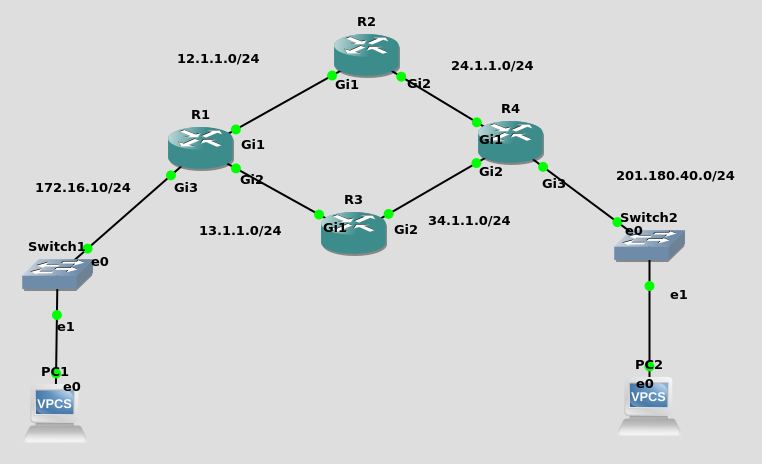
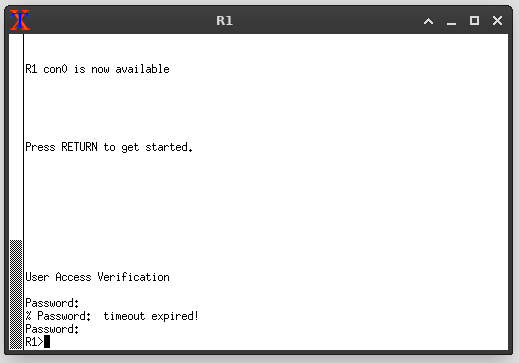
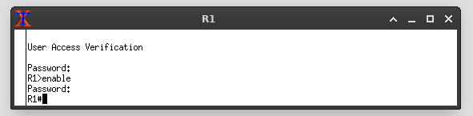
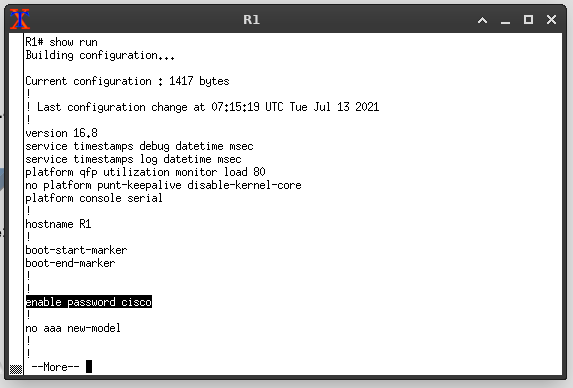
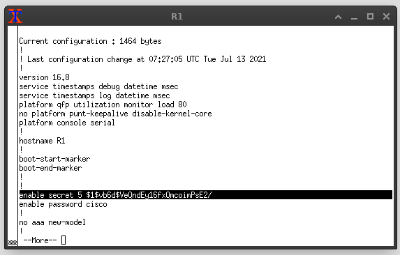
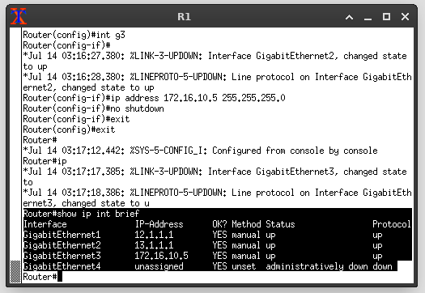
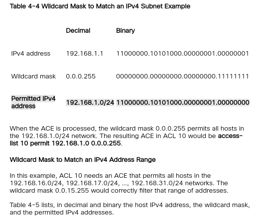

# Basic Cisco IOS command.
- cisco router or switches come with their own operating system.
- like Windows, MacOS or linux, cisco has their own operating system called IOS.
- to interact and configure Cisco router or switches, we need to use a CLI (command Line Interface), 
- it just like your command prompt in windows operating system. But with different command and syntax. 
- what is command ? command is just like a function that we can execute and passing parameters to it.
- view it like an interactive programming in python, where we use the `print` function to print something in python CLI.

## The basic of IOS console.
- first when you boot up and get into the router console you will see something like this
```
Router>
```
- this is the default `user exec mode` prompt for your console/terminal.
- this is how you interact with the router or switch.
- when we access our router os switches using telnet, SSH or console cable, we will get prompt to this.
- Here, there is not much we can do, we need to elevate our privilage into more privilage user.
- to elevate our privilage we write `enable` in the console. 
```
Router> enable
Router#
```
- here the `>` symbol changed into `#` indicating we sucessfully elevate our privilage.
- this is the `privilaged exec mode`, that enable us to perform more powerfull command that will effect the configuration of our router.
- from here we can perform global configuration by typing `configure terminal` into the prompt.
```
Router# configure terminal
Router(config)#
```
- noticed that he prompt once again changed.
- we are now changed into `global configuration mode` indicate by the `(config)`.
- here we can globably configure our router or switches, such as configuring the network interface.


## Basic Most usefull command.
- the most usefull command is the question mark `?`.
- you can use it to view list of available command in each mode.

```
Router> ?
```
- this will list all the available command you can run.
- let's try runb the show command.
```
Router> show ?
```
- appending question mark `?` at the end of our command will prompt you with the list of arguments you can use with that command.
- lets try showing ip interface information .
```
Router> show ip interface
```
- running above command will show you the list of network interface in our device (router or switches).
- let say we forgot the name of the command, we can use the question mark.
- let's say we know a command start with the letter `s`
```
Router> s?
show
ssh
```
- using the question mark will list all the available command start with the letter `s`.
- another trick is to use `tab` for outo completion.
- you can try this same trick inside `privilaged mode`.

# Basic router Configuration.
- you were given a routers, few PCs and an IP address from your ISP (internet service provider).
- what you need to do now is to connect you router to the internet.
- note that, your router is a network segmentation device, that divide the network of the internet with your own local network.
- now your task is to set up your devices.

## setting up our router IP address.
- imagine u are setting up a physical cisco router.
- first boot up our router.
- then plug in our network cable into the network interface.
- and plug in the console cable to the interface and to our laptop's serial interface and connect to our router.
- here, open up our terminal console and we will be greeted with the `user exec mode` prompt.
- we can run `show ip interface brief` to view list of network interfaces in our cisco router.

```
Interface             IP-Address   OK? Method Status           Protocol
GigabitEthernet0/0    unassigned   YES unset  administratively down down
GigabitEthernet0/1    unassigned   YES unset  administratively down down
GigabitEthernet0/2    unassigned   YES unset  administratively down down
GigabitEthernet0/3    unassigned   YES unset  administratively down down
```
- noticed that our network interface is in the `administratively down` state.
- let say we connected our network cable that takes the internet from our ISP into the `G0/0` interfaces.
- we then need to bring it up and assign an IP address to it.
- let say the given ip address via a dhcp server of ur ISP.
- to assign an IP address to our network interface, we need to change our prompt into the `global configuration` mode and get into the `interface` submode.
- then bring up our interface, and then assign the IP address.
- the steps are like this.
```
Router> enable
Router# configure terminal
Router(config)# interface g0/0
Router(config-if) ip address dhcp
Router(config)# no shutdown
```
- the first two command is simply entering the global config mode.
- the third is we telling it that we want to configure the g0/0 interface.
- the fourth is we say we want to configure ip address to be dynamic from dhcp server.
- our cisco router will perform dhcp request to get ip address from a dhcp pool.
- if we want to set the IP address statically,
- if we have an network address of `42.153.148.196/30`  we can do 
```
Router> enable
Router# configure terminal
Router(config)# interface g0/0
Router(config-if)# ip address 42.153.148.199 255.255.255.252
Router(config)# no shutdown
```
- now we successfully set up ip address to one of our network interface.


# Basic Topology And Router Setup.

- lets take this diamon topology as an example.
- we are going to configure 4 routers with an IP address on each of their network interface.
- we will change the hostname of our router.
- we also going to learn to set up password for our router to prevent unauthorized access.
- we then will enable remote SSH login and changing Banner.
- we then going to configure default routing protocol for our router.
- we will configure VLAN on the switch.
- after finish configure our routers and switches, we will try ping from PC1 to PC2.

# Configure.
- for most part when configuring our routers. the command and flow are identical and repeatable with slights changes on the `IP address`.
 - lets first go into our first router `R1`, and change the default hostname to `R1`.
 - we first go into privilage mode and then into global config mode
 ```
 Router> enable
 Router# configure terminal
 Router(config)# hostname R1
 R1(config)#
 ```
 - then we can enable password and secret.
 - secret is an encrypted version for password stored in our router.
 - there are 4 types of authentication we can set on our router
    1. console password
    2. telnet password
    3. enable password.
    4. enable secret.

## Console Password.
- console password is the password prompted to use when we first gain access to the console prompt. `Router>`.
- by default there is no password set to access this prompt.
- we can set it ourselves like this.
```
R1(config)# line console 0
R1(config-line)#password mypasswordtest
R1(config-line)#login
```
- this will force user to give password everytime we start connect to our router console.


## enable password.
- remember that when we want to gain `privilage` access to our router, we write `enable`.

- by default gaining privilage access doesn't require any authentication.
- we can set it ourselve using.
```
R1(config)# enable password mytestpasswordforenable
R1(config)#
```
- so then whenever we try to access privilage mode, we will be prompted with having to give the password.


## enable secret.
- secret is same as password.
- we did the same thing, we set up an authentication for `enable` command.
- the only different is that, secret are stored in `hashed` while password is stored as `plain text`.
- we can verify this by look at our `running-configuration` file.
```
R1# show running-config
```

- noticed that `cisco` is the password I set for my router.
- let now try enable secret and view our encrypted password.
- we will set `cisco2020` as our secret
```
R1(config)# enable secret cisco2020
R1(config)# exit
R1# show running-config
```

- noticed the different ?
- in case of our router got hacked. if we use secret, there is less likely our password got leak.


## Configure remote access.
- common remote access we use are
    - SSH.
    - telnet.
- we use one of these protocol to access our router remotely.
- physically we usually access our router via serial console.

### configure telnet.
```
R1(config)# line vty 0 4 
R1(config-line)# password cisco2020
R1(config-line)# login
```
- as we can see here, the flow is almost the same as we setup password for console access. the different is we use `vty` instead of `console`.
### configure ssh.
- SSH is a more secure alternative to telnet.
- here first we need to set up our router to have a domain name, username and password.
- the password we use is encrypted with RSA algorithm.
```
R1(config)# ip domain name cisco.com
R1(config)# username gintama password cisco2020
R1(config)# crypto key generate rsa
```
- you will be prompted asking on how many bits in the modulus, choose `1024`. 
- then continue enabling SSH.
```
R1(config)# ip ssh version 2
R1(config)# line vty 0 4 
R1(config-line)# transport input ssh
```
- noticed how this part of configuration is the almost same as setting up telnet?
- the different is that we use ssh as our transport input. so telnet will no longer be available (it will overide telnet transport input).
- if you once again want to enable telnet, you can change the transport input to telnet.
```
R1(config)# line vty 0 4
R1(config-line)# transport input telnet
```

### global service password encryption.
- this will encrypt all stored password including `enable` and `console` password.
- but the encryption algorithm used in this config is not that secure.
```
R1(config)# service password-encryption

```

### Set password length
- to set minimum password length of 10
```
R1(config)# security password min-length 10
```

### enable timeout upon SSH/telnet login.
```
R1(config)# line vty 0 4
R1(config)# exec-timeout 5 0
```

### Create a Banners
- this banners will warns anyone accessing the device remotely.
- we will print a meeesage saying "Unauthorized Access Prohibited!"
```
R1(config) banner motd #Unauthorized Access Prohibited!#
```


### Save Our Running Configuration as startup-config
- all the configuration we had set is currently stored in the RAM.
- which is not permenant.
- if we restart our router, it will be lost, and we need to re-configure it again.
- to make it permenant, we can save it as `startup-config` that will be load whenever the router start.
```
R1# copy running-config startup-config
```


## Assigning IP address to each Router Interfaces.
- next things to do is assigning ip address to our router.
- setps we need to do are:
    1. from privilage mode go into global config mode.
    2. go into interface config submode.
    3. assign ip address and netmask using `ip` command.
    4. bring up our interface using `no shutdown` command.

- in this example, we set ip address to interface gigabit 1 of router 1.
- just repeat this step in each interface and each routers.
- make sure to change the ip address and interface name.
```
R1> enable
R1# configure terminal
R1(config)# interface g1
R1(config-if)# ip address 12.1.1.1 255.255.255.0 
R1(config-if)# no shutdown
R1(config)# exit 
```
- repeate step 3 to 6 with interface g2 and g3, to assign ip address and network mask to it.
- then we can check to verify that our interface have the correct address.
- we can use `show ip interface brief` command.
```
R1# show ip interface brief
```

- now we successfully configure ip address for each interface of our router.
- next part we will set routing protocol, for our router to foward packets to another router.


## OSPF Routing.
- here we will learn how to set up OSPF routing.
- OSPF routing is part of dynamic routing.
- it is dynamic because we don't need to manully set up our router to know all the network in the routering mesh.
- what our router did, was sharing knowledge of its connected network topology with its neighbour. the neighbour will do the same and exchange their with our router.
- thus forming 3 table of routes.
    - neigbour table
    - topology table
    - network sturcture table.

- to set up OSPF, we need o establish a neighbour relationship with other router.
- our router will sent a `Hello` packet to `multicast` ip address of its network to find neigbouring router.
- the neigbour also need to send `Hello` message to our router to establish relationship. before they can exchange routing information.

### enabling OSPF in our routers
- things we need for this configuration are
    - network address
    - wildcard mask 
    - area number
- network address, is all connected network address to our router.
    - in case of R1, it will be
    ```
    12.1.1.0
    13.1.1.0
    172.16.10.0
    ```
    - this is the network address, not the ip address of our interface.

- [wildcard address](https://www.ciscopress.com/articles/article.asp?p=3089353&seqNum=5) refer here.

    - in case of /24 network, the address should be `0.0.0.255`

- for the are number, we use are 0.
- example configuration of Router 1
```
R1(config)# router ospf 1
R1(config-router)# network 12.1.1.0 0.0.0.255 area 0
R1(config-router)# network 13.1.1.0 0.0.0.255 area 0
R1(config-router)# network 172.16.10.0 0.0.0.255 area 0
```
- for router 2 it will be like this
```
R2(config)# router ospf 1
R2(config-router)# network 12.1.1.0 0.0.0.255 area 0
R2(config-router)# network 24.1.1.0 0.0.0.255 area 0
```
- repeate this process with other router.
- to check for ospf neigbour discovery is success, we use 
```
R1# show ip ospf neighbor
```