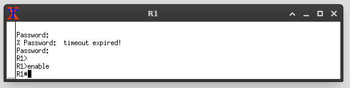

# Basic Cisco IOS command.
- cisco router or switches come with their own operating system.
- like Windows, MacOS or linux, cisco has their own operating system called IOS.
- to interact and configure Cisco router or switches, we need to use a CLI (command Line Interface), 
- it just like your command prompt in windows operating system. But with different command and syntax. 
- what is command ? command is just like a function that we can execute and passing parameters to it.
- view it like an interactive programming in python, where we use the `print` function to print something in python CLI.

## The basic of IOS console.
- first when you boot up and get into the router console you will see something like this
```
Router>
```
- this is the default `user exec mode` prompt for your console/terminal.
- this is how you interact with the router or switch.
- when we access our router os switches using telnet, SSH or console cable, we will get prompt to this.
- Here, there is not much we can do, we need to elevate our privilage into more privilage user.
- to elevate our privilage we write `enable` in the console. 
```
Router> enable
Router#
```
- here the `>` symbol changed into `#` indicating we sucessfully elevate our privilage.
- this is the `privilaged exec mode`, that enable us to perform more powerfull command that will effect the configuration of our router.
- from here we can perform global configuration by typing `configure terminal` into the prompt.
```
Router# configure terminal
Router(config)#
```
- noticed that he prompt once again changed.
- we are now changed into `global configuration mode` indicate by the `(config)`.
- here we can globably configure our router or switches, such as configuring the network interface.


## Basic Most usefull command.
- the most usefull command is the question mark `?`.
- you can use it to view list of available command in each mode.

```
Router> ?
```
- this will list all the available command you can run.
- let's try runb the show command.
```
Router> show ?
```
- appending question mark `?` at the end of our command will prompt you with the list of arguments you can use with that command.
- lets try showing ip interface information .
```
Router> show ip interface
```
- running above command will show you the list of network interface in our device (router or switches).
- let say we forgot the name of the command, we can use the question mark.
- let's say we know a command start with the letter `s`
```
Router> s?
show
ssh
```
- using the question mark will list all the available command start with the letter `s`.
- another trick is to use `tab` for outo completion.
- you can try this same trick inside `privilaged mode`.

# Basic router Configuration.
- you were given a routers, few PCs and an IP address from your ISP (internet service provider).
- what you need to do now is to connect you router to the internet.
- note that, your router is a network segmentation device, that divide the network of the internet with your own local network.
- now your task is to set up your devices.

## setting up our router IP address.
- imagine u are setting up a physical cisco router.
- first boot up our router.
- then plug in our network cable into the network interface.
- and plug in the console cable to the interface and to our laptop's serial interface and connect to our router.
- here, open up our terminal console and we will be greeted with the `user exec mode` prompt.
- we can run `show ip interface brief` to view list of network interfaces in our cisco router.

```
Interface             IP-Address   OK? Method Status           Protocol
GigabitEthernet0/0    unassigned   YES unset  administratively down down
GigabitEthernet0/1    unassigned   YES unset  administratively down down
GigabitEthernet0/2    unassigned   YES unset  administratively down down
GigabitEthernet0/3    unassigned   YES unset  administratively down down
```
- noticed that our network interface is in the `administratively down` state.
- let say we connected our network cable that takes the internet from our ISP into the `G0/0` interfaces.
- we then need to bring it up and assign an IP address to it.
- let say the given ip address via a dhcp server of ur ISP.
- to assign an IP address to our network interface, we need to change our prompt into the `global configuration` mode and get into the `interface` submode.
- then bring up our interface, and then assign the IP address.
- the steps are like this.
```
Router> enable
Router# configure terminal
Router(config)# interface g0/0
Router(config-if) ip address dhcp
Router(config)# no shutdown
```
- the first two command is simply entering the global config mode.
- the third is we telling it that we want to configure the g0/0 interface.
- the fourth is we say we want to configure ip address to be dynamic from dhcp server.
- our cisco router will perform dhcp request to get ip address from a dhcp pool.
- if we want to set the IP address statically,
- if we have an network address of `42.153.148.196/30`  we can do 
```
Router> enable
Router# configure terminal
Router(config)# interface g0/0
Router(config-if)# ip address 42.153.148.199 255.255.255.252
Router(config)# no shutdown
```
- now we successfully set up ip address to one of our network interface.


# Basic Topology And Router Setup.

- lets take this diamon topology as an example.
- we are going to configure 4 routers with an IP address on each of their network interface.
- we will change the hostname of our router.
- we also going to learn to set up password for our router to prevent unauthorized access.
- we then will enable remote SSH login and changing Banner.
- we then going to configure default routing protocol for our router.
- we will not doing any configuration with the switch.
- after finish configure our routers, we will try ping from PC1 to PC2.

# Configure.
- for most part when configuring our routers. the command and flow are identical and repeatable with slights changes on the `IP address`.
 - lets first go into our first router `R1`, and change the default hostname to `R1`.
 - we first go into privilage mode and then into global config mode
 ```
 Router> enable
 Router# configure terminal
 Router(config)# hostname R1
 R1(config)#
 ```
 - then we can enable password and secret.
 - secret is an encrypted version for password stored in our router.
 - there are 4 types of authentication we can set on our router
    1. console password
    2. telnet password
    3. enable password.
    4. enable secret.

## Console Password.
- console password is the password prompted to use when we first gain access to the console prompt. `Router>`.
- by default there is no password set to access this prompt.
- we can set it ourselves like this.
```
R1(config)# line console 0
R1(config-line)#password mypasswordtest
R1(config-line)#login
```
- this will force user to give password everytime we start connect to our router console.


## enable password.
- remember that when we want to gain `privilage` access to our router, we write `enable`.

- by default gaining privilage access doesn't require any authentication.
- we can set it ourselve using.
```
R1(config)# enable password mytestpasswordforenable
R1(config)#
```
- so then whenever we try to access privilage mode, we will be prompted with having to give the password.


## enable secret.
- secret is same as password.
- we did the same thing, we set up an authentication for `enable` command.
- the only different is that, secret are stored in `hashed` while password is stored as `plain text`.
- we can verify this by look at our `running-configuration` file.
```
R1# show running-config
```

- noticed that `cisco` is the password I set for my router.
- let now try enable secret and view our encrypted password.
- we will set `cisco2020` as our secret
```
R1(config)# enable secret cisco2020
R1(config)# exit
R1# show running-config
```

- noticed the different ?
- in case of our router got hacked. if we use secret, there is less likely our password got leak.


## Configure remote access.
- common remote access we use are
    - SSH.
    - telnet.
- we use one of these protocol to access our router remotely.
- physically we usually access our router via serial console.

### configure telnet.

### configure ssh.


### global service password encryption.