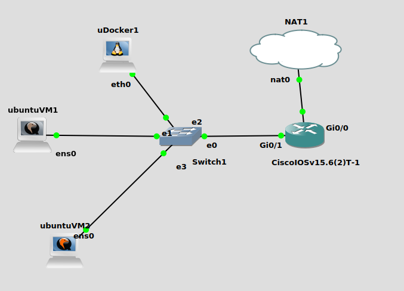

# Basic Topology 01

- our topology look like this
- there are 3 linux machine (ubuntu) connected to a switch on ports:
  - ethernet01
  - ethernet02
  - ethernet03
- while ethernet00 port of the switch is connected to port `gigabit0/1` of the router.
- the cisco router are connected to internet on port `gigabit0/0`.
  
- note that the switch used here is a unmanaged switch, so we do not have to configure it.

## Configuring the CISCO router.

- boot up our cisco swith.
- use `R1# sh ip int brief` to show brief info about our network interface.
  - we will see something like this.
  ```
  Interface             IP-Address   OK? Method Status           Protocol
  GigabitEthernet0/0    unassigned   YES unset  administratively down down
  GigabitEthernet0/1    unassigned   YES unset  administratively down down
  GigabitEthernet0/2    unassigned   YES unset  administratively down down
  GigabitEthernet0/3    unassigned   YES unset  administratively down down
  ```
  - we can see that all of our ports are down.
- use `R1# configure terminal` to enter configuration mode.

### Configure G0/0

- `R1(config)#int g0/0` to select interface `GigabitEthernet0/0`.
- enable dhcp in this interface (means this interface get IP address from WAN).
  - use `R1(config-if)#ip address dhcp`
  - brign up this interface `R1(config-if)#no shutdown`.
  - `R1(config-if)#end` to go out of this selected interface.
- go to config terminal again using `R1#conf t`
- then enable `domain-lookup` so we can `ping google.com`
  - `R1(config)#ip domain-lookup`.
  - then we can try ping google.
  - go out from config terminal using `R1(config-if)#end`
  - then use `R1# ping google.com`
  - check our interface is up using `R1#sh ip interface brief `

### Configure G0/1

- go to config terminal and select interface `g0/1`.
- then configure network for this interface.
  - `R1(config-if)#ip address 10.1.1.1 255.255.255.0`
  - then bring this interface up `R1(config-if)#no shut`
  - go out of config terminal and then check our interface
  - `R1#sh ip interface brief `
- if both of the interface is up and running, we can now create dhcp pool.
- enter config terminal and create new pool named `mypool1`
  - `R1(config)#ip dhcp pool mypool1`
  - then configure network for the dhcp
  - `R1(dhcp-config)#network 10.1.1.0 255.255.255.0`
  - set default router to this router ip.
    - (note that this router ip we set when we configure network for this interface.)
    - `R1(dhcp-config)#default-router 10.1.1.1`
  - then set dns-server to google dns
  - `R1(dhcp-config)#dns-server 8.8.8.8`
- then go out of config and check for dhcp config
- `R1#sh run | b dhcp`

  - you will see somethign like this.

  ```
    ip dhcp pool mypool1
    network 10.1.1.0 255.255.255.0
    default-router 10.1.1.1
    dns-server 8.8.8.8
    !
    !
    !
    ip cef
    no ipv6 cef
    !
    multilink bundle-name authenticated
    !

  ```

  - if everything ok, we can start configure the linux client to get dhcp and dns from the network.

### Configure Linux Client.

- start our linux client and get into the shell (terminal)
- to get request ip address from dhcp we need to configure this file.

  - `/etc/network/interfaces`
  - open this file using text editor of your choice (make sure you are super user).
  - we will se somethign like this.

  ```conf
  #
  # This is a sample network config uncomment lines to configure the network
  #


  # Static config for eth0
  #auto eth0
  #iface eth0 inet static
  #	address 192.168.0.2
  #	netmask 255.255.255.0
  #	gateway 192.168.0.1
  #	up echo nameserver 192.168.0.1 > /etc/resolv.conf

  # DHCP config for eth0
  #auto eth0
  #iface eth0 inet dhcp

  ```

  - to enable dhcp, we just simply uncomment the part saying `auto eth0` and `iface etho inet dhcp`.
  - after uncomment this , save the file (make sure you are root).
  - the file will look like this.

  ```conf
    #
    # This is a sample network config uncomment lines to configure the network
    #


    # Static config for eth0
    #auto eth0
    #iface eth0 inet static
    #	address 192.168.0.2
    #	netmask 255.255.255.0
    #	gateway 192.168.0.1
    #	up echo nameserver 192.168.0.1 > /etc/resolv.conf

    # DHCP config for eth0
    auto eth0
    iface eth0 inet dhcp

  ```

  - what that two lines does is that, saying we are using interface eth0 (ethernet0).
  - then we want our interface eth0 to get internet address via dhcp.
  - then simply restart our network manager using either

    - `sudo systemctl restart networking`
    - or `sudo /etc/init.d/networking restart`

  - alternativly is we running a docker client or client that unable to restart networking, simply restart our machine it.
  - our client will then trying to get ip address from the pool and the router will lease it to them.

### Checking our DHCP pool in Router.

- use `R1#show ip dhcp binding`
  - this will show us ip address leased to client.
- we can enable debuging via
  - `R1#debug ip dhcp server packet`
  - whenever a client request for IP, we can see the entry here.

### Client Cannot Ping Google ?

- at this point, our client are unable to connect to google.
- because the NAT cloud network `192.168.122.1` at `g0/0` have no idea about our local `10.1.1.1` network at `g0/1` interface of our router.
- consider this, the `192.168.122.1` is the public ip address that are globally unique, you received from your ISP.
- then the `10.1.1.1` is our local private network.
- the internet have no ideas how to route from public ip to your local private ip.

### How NAT works.

- NAT is stand for Network Address Translation.

#### Network without NAT

- (this is a rough example)
- NAT is like a table, that map where to send the received packet from public network to the internal private network.
- if a host (10.1.1.2) send a request to google (8.8.8.8).
- the router receive the packet. it changes the source address as its address.
- the source address is now 192.168.122.46 (our router address at g0/0).
- router then send the packet to google, and google reply to that.
- google will send packet with destination address 192.168.122.46.
- the router then receive a packet that are meant for (10.1.1.2) but with the destination address as 192.168.122.46 instead.
- the reason 10.1.1.2 is not the destination address is that it is a private address and are not routable in the public network.
- because our router are not configured with NAT, it doesn't know where to send that packet, because there is no table for it to refer to.
- because the final address is the address of the router interface, the router simply assume that it is the final destination.
- by configuring NAT, the router can have a table to refer, and change the destination address to (10.1.1.2).

#### Network with NAT.

- with NAT (using overload NAT as example).
- overload NAT use port number to map, traffic to each host in the network.
- here we take our example where our router only have single IP address to connect to outside network (192.168.122.46).
- when a host (10.1.1.2) send a request to google (8.8.8.8) it generate a TCP/IP port number which let say 4444.
- the router receive the request, it take the IP address and the port add it in a table
- it will look like this (simplified version)

```
Inside:port         Outside:port
10.1.1.2:4444     192.168.122.46:4444
10.1.1.3:4444     192.168.122.46:4445
10.1.1.4:5000     192.168.122.46:5000
```

- noticed that the ourside IP address is always the same
- what changes is the ports assignment.
- every private host will be resolve to this one outside ip address with different port.
- so the router take the packet from host and then assign its IP address + the port (192.168.122.46:20) as the source address of the packets.
- these ports are the unique port generated by the TCP/IP sessions.
- if another host (10.1.1.3) make a request to google generating the same port number (4444),the router will simply increment the port number for the ourside address in its table.

```
Inside:port         Outside:port
10.1.1.2:4444     192.168.122.46:4444
10.1.1.3:4444     192.168.122.46:4445 <--- incremented
10.1.1.4:5000     192.168.122.46:5000
```

### Types of NAT configuration.

1. Static NAT (one to one map)
2. Dynamic NAT (many to many map)
3. Overload NAT (port mapping)

- in general to configure NAT in cisco router we use the `ip nat inside/outside` command.
- inside is for the router inside interface that face our internal network
- outside is for the interface facing our external network.
- [READ MORE](https://www.cisco.com/c/en/us/support/docs/ip/network-address-translation-nat/4606-8.html)
- we can see our nat table using `R1# show ip nat translations`

### Configuring Static NAT.

- to configure static NAT, we need to map 1 internal ip address to 1 public ip address.
- `R1#conf t`
- `R1(config)#ip nat inside source static 10.1.1.1 192.168.122.46`
- `R1(config)#interface g0/0`
- `R1(config-if)#ip nat outside`
- `R1(config)#interface g0/1`
- `R1(config-if)#ip nat inside`

### Configure Dynamic NAT.

- `R1#conf t`
- `R1(config)#int g0/0`
- `R1(config-if)#ip nat outside`
- `R1(config-if)#int g0/1`
- `R1(config-if)#ip nat inside`
- `R1(config-if)#exit`
- `R1(config)#access-list 1 permit any`
- `R1(config)#ip nat pool MY_POOL 192.168.1.1 192.168.1.3 netmask 255.255.255.0`
- let say our pool consist of 3 address `192.168.1.1`,`192.168.1.2` and `192.168.1.3`.
- `R1(config)#ip nat inside source list 1 pool MY_POOL`

### Configure Overload NAT.

- `R1#conf t`
- `R1(config)#int g0/0`
- `R1(config-if)#ip nat outside`
- `R1(config-if)#int g0/1`
- `R1(config-if)#ip nat inside `
- `R1(config-if)#exit`
- `R1(config)#ip nat inside source list 1 interface g0/0 overload`
- `R1(config)#access-list 1 permit any`
- `R1(config)#end`
- `R1#show ip nat translations`
- output of our NAT translation look something like this.

```
Pro Inside global      Inside local       Outside local      Outside global
udp 192.168.122.46:35837 10.1.1.2:35837   91.189.89.199:123  91.189.89.199:123
tcp 192.168.122.46:55536 10.1.1.2:55536   8.8.8.8:53         8.8.8.8:53
tcp 192.168.122.46:55538 10.1.1.2:55538   8.8.8.8:53         8.8.8.8:53
tcp 192.168.122.46:55540 10.1.1.2:55540   8.8.8.8:53         8.8.8.8:53
udp 192.168.122.46:58343 10.1.1.2:58343   91.189.89.199:123  91.189.89.199:123
udp 192.168.122.46:37668 10.1.1.4:37668   91.189.94.4:123    91.189.94.4:123
udp 192.168.122.46:37965 10.1.1.4:37965   91.189.94.4:123    91.189.94.4:123
tcp 192.168.122.46:56546 10.1.1.4:56546   8.8.8.8:53         8.8.8.8:53
tcp 192.168.122.46:56548 10.1.1.4:56548   8.8.8.8:53         8.8.8.8:53
udp 192.168.122.46:58094 10.1.1.4:58094   8.8.8.8:53         8.8.8.8:53
icmp 192.168.122.46:87 10.1.1.5:87        142.250.199.46:87  142.250.199.46:87
udp 192.168.122.46:43292 10.1.1.5:43292   8.8.8.8:53         8.8.8.8:53
udp 192.168.122.46:46811 10.1.1.5:46811   8.8.8.8:53         8.8.8.8:53

```

- our linux hosts can now ping google and perform software update.
