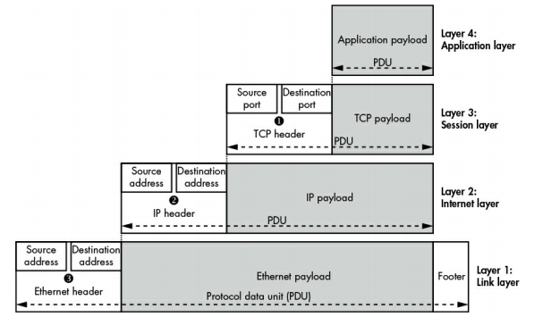

# About this Folder.

Basically things I learned about networking, such as linux network configuration,
topology design and implementation either using CISCO IOS devices or linux network router etc, it's been a while since I learn CCNA, so I just revisit it here. Most of the network topology examples, I run in network simulation or virtual machine for cases like setting up DHCP server or DNS server.

# Basic Networking (General).

- network is two or more devices connected together to share data or information.
- to communicate with each other these devices need an address.
- in order for these devices to understand the communication they need a common ground/language or protocols that define the communication.

## Address.

- IP address (logical addresss generated for a network)
- MAC address ( unique physical address flashed into network card)

## TCP/IP Model.

- TCP/IP is a protocol that defined how data being transmitted in a network.
- it's an abstraction on how the communication are made.
- the model or suite is devided by layers:
  - Application layer (here is where our application such as browser at)
  - transport layer (this is also where sessions take place)
  - internet layer (here where our IP address sets)
  - link layer (here where our MAC address / ethernet cable at)
- each layer interact with one another.
- example:

  - let say we open a browser and go to `www.google.com`
  - our browser is the `Application layer` that present data to user.
  - going down a layer is when our browser trying to make connection to google's server.
  - this communication to create a connection session is in the `transport layer`.
  - to create a connection, we craft a message example saying `hey google browsr want to create a two way communicaton with you`.
  - we then assgin a port number to associate the message with the service sending the message which is the browser process.
    - note: port number usually associate with services.
  - to send that message, we pass the message down under a layer which is the `Internet layer`.
  - here Internet layer assign the address which is the IP address of Google server to the message. It encapsulate the message in an envelop with the address.
  - then we pass it to the physical layer. here we give another address which is the MAC address.
  - physical layer is where the message get transported thru network cable or maybe radio wave (wifi).

  - diagram representing the layer and data encapsulation.
    

## Routing.

- Routing consist of nodes devices called router.
- a Router connect one or more network together.
- Router are used to transfer data betweens network, it acts as the main gateways
- Routers communicates with each other in order to determines the best route/path to transfer data.
- after the best path are determined, they use that path to send data.
- the path are stored in a Routing table.

### Router.

- router is just another devices like our computer but specialize to handle routing.
- like any other devices, it has its own CPU, memory and operating system, and I/O ports.
- there are 2 common Interfaces that you need to know

  - LAN Interface
    - LAN (Local Area Network).
    - it's usually an Ethernet that connect to devices in our private network.
  - WAN Interface
    - WAN (Wide Are Network).
    - use to connect to another router or Wide networks own by the ISP (internet Service Provider).

- router takes ethernet frame (physical layer), de-encapsulates it, view the destination IP address, lookup the best path to reach the destination, then re-encapsulates the frame with the next router mac address as the destination address without changing the destination IP address.
- the only address changing while routing is the (physical layer) mac address.
