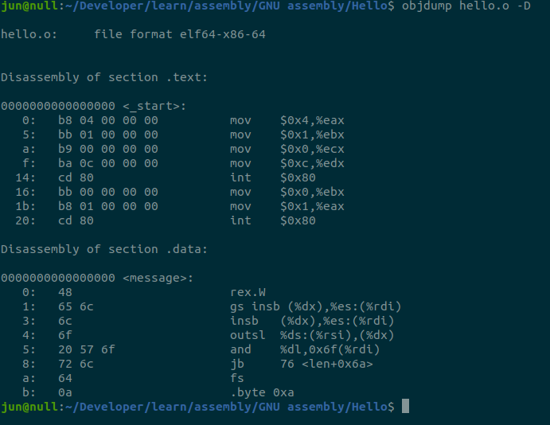

# Learning Assembly and System Programming

### Linux Kernel.

- Linux OS, is a GNU Operating system. it's a operating system that consist of a Linux Kernel (open source version of Unix Kernel), and a GNU tools set and other Open source software.
- Kernel, functions as a manager of everything. it manages programs(a software) access to the hardware underneath.
- Kernel, helps ease the problem of having to write a low level program to communicate with the hardware by providing an abstract layer for programmer.
- without a Kernel, every programmer need to write different code entirely for different hardware model.
- when we write something on our keyboard. the hadware sends electrical signal to the other hardware where the kernel sits in. the kernel (that manage all hardware), receive a signal from the keyboard in form of [scancodes](https://www.win.tue.nl/~aeb/linux/kbd/scancodes-1.html).
- the kernel than translate the information and pass the output to needed program.
- A machine only understand electrical signal, and the level of that signal (low/high) is encoded into a number 1 or 0 (binary). In short, a machine understand a binary arithmatics.
- some sequence of number can indicate certain operations in the system.
- Having to deal with numbers can be a hassel, thus computer scientist represent some of the operation with a mnemonics letters forming what we call the [assembly language](https://techterms.com/definition/assembly_language).

### Computer Architecture.

- Modern Computer is based on a [Von Neumann architecure](https://vivadifferences.com/5-major-difference-between-von-neumann-and-harvard-architecture/).
- that consist of the Central Processing Unit (CPU), and the Memory.
- A computer is basically a computing machine, that perform arithmatic.
- it takes data from an input devices, and manipulate it with help of memory to store and moving data, imagine memory as common math exercise book, consist of grid of boxes that we write numbers in it.
  
- each boxes have their own location address that we can get the position.
- in context of the math books, we can get the address of a box by using the plane system by finding it's location in x and y-axis.
- we can look a smaller box as a bit and a group of 4 small box is like a bytes. and we can come out with a new address of the big box.
- having the address of the big box, we can future devide it to get the address of the smaller box.
- all information are stored in memory. not only the program data, but also the program itself.
- a program is basically a set of instructions to perform operations.

### CPU.

- a CPU typically, consist of
  - Program Counter
  - Instruction Decoder
  - Data bus
  - General Purpose Registers
  - Arithmetic and Logic Unit.

### CPU Instruction.

- an instruction consist of a `operation code` (opcode) and `operands`
- `opcode`/instruction is mnemonics for operations such as `LOAD`, `MOVE`, `ADD`, `STORE`.
- when we want to tell a machine to add something, we use the `ADD` operation, which takes two `operands`.

```assembly
ADD R0, R2,R3 ; this is example of add operation,
          ; it takes R0, R2 and R3 as its operands
```

- what it means is that we add something from `R3` with `R2` and store it into `R0`. this example is using nasm syntax (right mov to left).
- operands is basically a data like an arguments to ADD function.
- we can pass these data to CPU via few different ways.
- ways CPU accessing data, is called [addressing modes](https://binaryterms.com/addressing-modes-and-its-types.html).
- thare are diffrents `addressing modes` such as:
  - `immediate mode`; actual/immediate data are given.
  - `register addressing mode`; a register contains actual value.
  - `indexed addressing mode`; a register contains address of value in CPU memory.
  - `direct addressing mode` ; an address of value located in CPU memory.
- these addressing modes, indicates whether data is passed directly or indirectly via reference pointing to memory address or a register holding a value.

### Addressing Mode calculation.

- `ADDRESS_OR_OFFSET` is a constant
- `MULTIPLIER` is a constant
- `BASE_OR_OFFSET` usually the contents of base pointer register.
- `INDEX` usually contents of Index register

```
FINAL_ADDRESS = ADDRESS_OR_OFFSET + %BASE_OR_OFFSET + %INDEX * MULTIPLIER
```

- direct addressing example.
  ```assembly
  movl ADDRESS_OR_OFFSET, %eax
  ```
  - this load `ADDRESS_OR_OFFSET` into `%eax`
- index addressing example.

  ```assembly
  .section .data
  mydata_array:
      .long 2,0,4,1,3

  .section .text
  .global _start
  start:
    movl $3,%edi #t3 into edi (index register) indicating 3rd index
    movl mydata_array(,%edi,4), %eax
    incl %edi;
  ```

  - we declared an arrays of 4 bytes (4x5 = 20bytes) using .long named mydata_array (our ADDRESS_OR_OFFSET).
  - `%edi` contains the value 3, indicating 3rd index.
  - in `movl` instruction we move value of the 3rd index into `%eax` \* multiplier
  - `4` is a multiplier to our index, telling that our memory address space is 4 bytes, means the addresss is [->4][->8][->12][->16][->20].
  - the [address operand syntax](https://en.wikibooks.org/wiki/X86_Assembly/GAS_Syntax#Address_operand_syntax) we use is.

  ```
  ADDRESS_OR_OFFSET(BASE_OR_OFFSET, INDEX, MULTIPLIER)

  which means:

    ADDRESS_REGISTER + BASE_POINTER + (INDEX * MULTIPLIER)

  so

  mydata_array(, %edi, 4);

  means:
    mydata_array + ( 0 + ($di * 4) )

  because we do not use any base pointer register, first arguments is left empty.
  ```

  ```
  let say our address start at 0
  our formula is.
  FINAL_ADDRESS = ADDRESS_OR_OFFSET + %INDEX * MULTIPLIER

  so> FINAL_ADDRESS = 0 + %edi * 4
    > FINAL_ADDRESS = 4 * 3

  ```

  ```
                $eax
                  ^
                  |
     0    4   8   12  16

    =====================
    | 2 | 0 | 4 | 1 | 3 |
    =====================

  ```

- Indirect addressing example.

  - a register `%eax` contains an address point to register that hold a value.
  - basically `%eax` is a pointer.
  - let say a processor register `%eax` hold the `memory location` (address) of value `30` in CPU memory.
  - using indirect addressing we copy value `30` into `ebx` by using the parenthesis `()`.

  ```assembly
  movl (%eax), %ebx
  ```

  - this will copy the value of `%eax` instead of the address stored in `%eax`.

  - try to exaplain using c++.

  ```cpp
  int value{30};
  int *eax {&value}; //let say eax hold addr of value 30.
  int ebxa{eax}; // yield address of value, if we mov %eax, %ebx ; we move address
  int ebxv{*eax}; //like mov (%eax), %ebx; we move value 30 itself
  ```

- Base pointer addressing example.

  - same as indirect aaddressing. but add constant value to the address.
  - let say we have a stack of 4 bytes [3,1,2,4]
  - let say `%eax` hold the address `0x1` which is the starting address of that stack in memory,
  - value `3` is located in address `0x1`, value `1` is at `0x2`, ...
  - to get the number 2 which is the value at index 3 in that stack and store it in %ebx.

  ```
  movl 2(%eax),%ebx
  ```

  - this take the address 0x1 and and 2 to it. = 0x3.
  - so we are taking the value at address 0x3 and mov to `ebx`.

  ```
  ADDRESS_OR_OFFSET(BASE_OR_OFFSET, INDEX, MULTIPLIER)

  which means:

    OFFSET + BASE_POINTER + (INDEX * MULTIPLIER)


    so> 2(0x1 + (0*0))
    means: 2+ (0x1)
    final address= 0x3
  ```

  - so

  ```assembly
    movl (0x3), %ebx
  ```

  - `%ebx` contains the value `2`

  ```
               $ebx
                 ^
                 |
        1    2   3   4   5

        =====================
        | 3 | 1 | 2 | 4 | 3 |
        =====================
  ```

## Outline of Assembly Program.

- anything start with a dot (.) is called a assembler directives or pseudo-operator.
- it is not an CPU instruction, instead something telling the assembler what to do with this information.
- we can see this as the preprocessor directives in C/C++ program that tells compiler what to do with the information when compiling.

  ### .(d0t)section

  - tells the assembler to divide our program into sections or segments.
  - each sections contains specific types of data.
  - if we see our object file, using `objdump` we can see the seperation.
  - most simple assembly program are divide into two sections.
  - `.data` or `.bss`; store static data for the program.
  - `.text`; contains instruction codes.
    
  - example running `objdump -D hello.o` ;
  - you can find `hello.o` in folder `x86/Hello/hello.o`.

  ### under the .section .text

  - we can see the starting of our instruction code.
  - this example use GAS syntax

  ```assembly
  # hashtag is a comments
  # INPUT: none
  # OUTPUT : Hello World
  # VARIABLES: eax, ebx, ecx ,edx
  # checkout intel syntax version in x86 folder.


  .section .text
  .global _start

  _start:
      movl $4, %eax       # mov linux sys_write(4) syscall number to eax.
      movl $1, %ebx       # mov file handler (stdout) to ebx (first argument)
      movl $message, %ecx # mov our message to ecx (second argument)
      movl $len, %edx     # mov message length to edx (third argument)
      int $0x80            # call kernel interupt and exit.

      movl $0, %ebx       #return exit code 0 to kernel.
      movl $1, %eax       # mov syscall for sys_exit(1) to eax.

      int $0x80            #call kernel interupt and run sys_exit
  .section .data
  message:
      .ascii "Hello World\n" # our output string
      len = .- message # length of our string


  # simple note:
  # eax : takes syscall
  # ebx : first argument
  # ecx : second argument
  # edx : third argument# hashtag is a comments
  # refer to `man syscall` and `man 2 syscalls`
  ```

  - we can see `.global _start`, which tells the assembler, that \_start is the symbol to label the location for our code.
  - we can write another function with label \_myfunct, then \_myfunct is a label to the location of our function instructions.
  - `.global` means that the assembler shouldn’t discard this symbol after assembly.
  - `_start` are usually marked with `.global` to indicate the starting point of our program.
  - it's like the main function in c/c++.
  - then we see the `_start:` which defines our label.

  ### The Assembly Instruction

  ```assembly
  movl $4, %eax #hashtag is a comment
  ```

  - the following instruction tells, the cpu, that we want to move,
    the value `4` the general purpose register `%eax`, which the dollar `$` sign infront indicating using the `immediate addressing` mode.
  - the `movl` is what we call an [opcode/insruction](https://retrocomputing.stackexchange.com/questions/5284/whats-the-difference-between-opcode-and-instruction-in-this-zilog-ad), `$4` and `%eax` is the operand for the instruction.
  - the reason we transfer `$4` into `%eax`, is that `$4` is the syscall for write.
  - refer [here](http://faculty.nps.edu/cseagle/assembly/sys_call.html)

  ### NOTES FROM wikibooks.

  - For GNU assembly syntax (GAS)
  - [reference](https://en.wikibooks.org/wiki/X86_Assembly/GAS_Syntax)
  - GAS assembly instructions are generally suffixed with the letters "b", "s", "w", "l", "q" or "t" to determine what size operand is being manipulated.

  ```
      b = byte (8 bit).
      s = single (32-bit floating point).
      w = word (16 bit).
      l = long (32 bit integer or 64-bit floating point).
      q = quad (64 bit).
      t = ten bytes (80-bit floating point).
  ```

  - If the suffix is not specified, and there are no memory operands for the instruction, GAS infers the operand size from the size of the destination register operand (the final operand).

  - so a base instruction like `mov` if we want to move 4 bytes we use `movl`, if we want to move single byte we use `movb`.
  - if we want to increment (`inc`) by 4 bytes we use `incl`

  ### What is syscall ?

  - syscall is like a function call.
  - we use it to tells the Linux kernel that we want to do something.
  - in the example above, we tell the kernel we want to invoke the write syscall. by moving `$1` into `%eax`.
  - the `write` syscall takes two arguments which is the `string` and the `length` of the string, we pass these argumrnts into `%ebx` and `%ecx` respectively.
  - after we put `$1` into `%eax` we call the kernel to run our syscall.
  - we do this by providing interupt number $0x80 `int $0x80` to the system which trigger the interupt handler for hex value `0x80`.
  - the interupt handler for code `0x80` in linux OS is the Kernel itself.
  - we can see the program calling the syscall if we run it using strace.
  - `strace ./hello`

## Conditional Statement in Assembly.

- in high level programming, we usually change our flow of instruction using the `if statement`.
- in assembly there are two ways to mimic `if` statement thru `conditional jump` and `unconditional jump` instructions.
- conditional jump, change path based on the condition/result of previous operations such as comparison or calculation.
- unconditional jump, simply jump to other path without influence by any condition, example of this is like `goto` in c++. we can go to specific label in code.

### list of conditional statements:

    - je    : jump if equal
    - jg    : jump if greater
    - jge   : jump if greater or equal
    - jl    : jump if less
    - jle   : jump if less or equal
    - jmp   : jump directly (unconditional)

## Looping in Assembly.

- in assembly there's no `for`,`do while`,`while` or any other loop.
- what we have is more like a recursion.
- what we do is:
  - we label part of code.
  - we check for condition
  - we jump to the label
  - this steps repeat until the condition statisfy what we want to do.

## Different Memory Types (like data types in C++)

- `.byte` :
  - allocate single byte of memory.
  - can store numbers between 0 and 255
- `.int` :
  - allocate 2 bytes of memory
  - can store numbers between 0 and 65535
- `.long` :
  - allocate 4 bytes of memory.
  - can store numbers between 0 to 4294967295
- `.ascii`:

  - converts a string into bytes and store each charecters into a single memory location.
  - example `"Hello\n"` will allocate 6 bytes/rooms and store each character from `'H'` to `\n` in each rooms.

- in the `findLargest` code example inside folder 'GNU assembly/conditional and loop'.
- we declared a list of numbers using `.long`
- what we did is that we allocate 4 bytes for each numbers in that list.
- in our list `2,3,1,99,125,33,21,255,11,0` of 10 numbers, we allocate 10 x 4 bytes of memory space (equals: 40 bytes).

```

```
